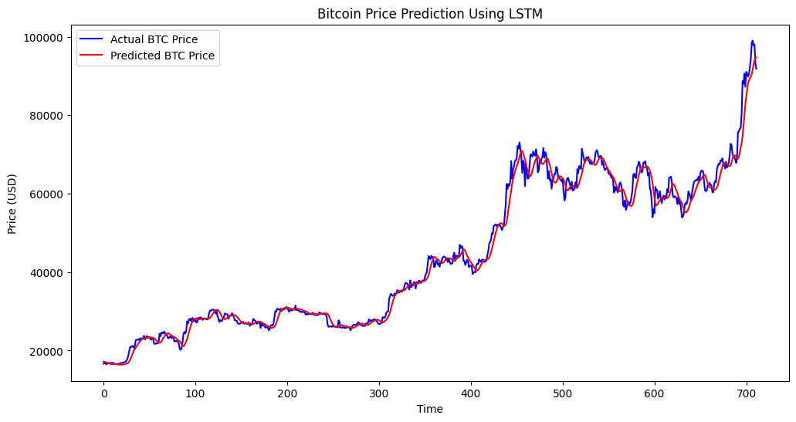

# Bitcoin Price Prediction

This project demonstrates how to predict Bitcoin prices using a Long Short-Term Memory (LSTM) neural network. The data is sourced from Yahoo Finance and the model is built using TensorFlow and Keras.

## Installation

To run this project, you need to install the required packages. You can do this by running the following command:

```bash
pip install yfinance pandas numpy scikit-learn tensorflow matplotlib
```

## Usage

1. **Import Libraries**: The necessary libraries are imported, including `yfinance`, `numpy`, `pandas`, `matplotlib`, `sklearn`, and `tensorflow`.

2. **Load Data**: Bitcoin data is loaded from Yahoo Finance, focusing on the 'Close' price.

    - Change the date to game more accurate data.

3. **Normalize Data**: The data is normalized using `MinMaxScaler`.

4. **Prepare Data**: The data is prepared for training by using 60 previous days to predict the next day's price.

5. **Split Data**: The data is split into training and testing sets (80% training, 20% testing).

6. **Build Model**: An LSTM model is built with two LSTM layers and dropout for regularization.

7. **Train Model**: The model is trained for 10 epochs with a batch size of 32.

8. **Predict Prices**: The model predicts prices on the test set and the results are plotted.

9. **Evaluate Model**: The model is evaluated using Mean Squared Error (MSE).

10. **Forecast Future Prices**: The model forecasts future prices for the next 5 days.

## Results

The project includes visualizations of the actual vs predicted Bitcoin prices and the forecasted prices for the next 5 days.




## License

This project is licensed under the MIT License.

## Acknowledgements

- [Yahoo Finance](https://finance.yahoo.com/) for providing the data.
- [TensorFlow](https://www.tensorflow.org/) and [Keras](https://keras.io/) for the deep learning framework.
